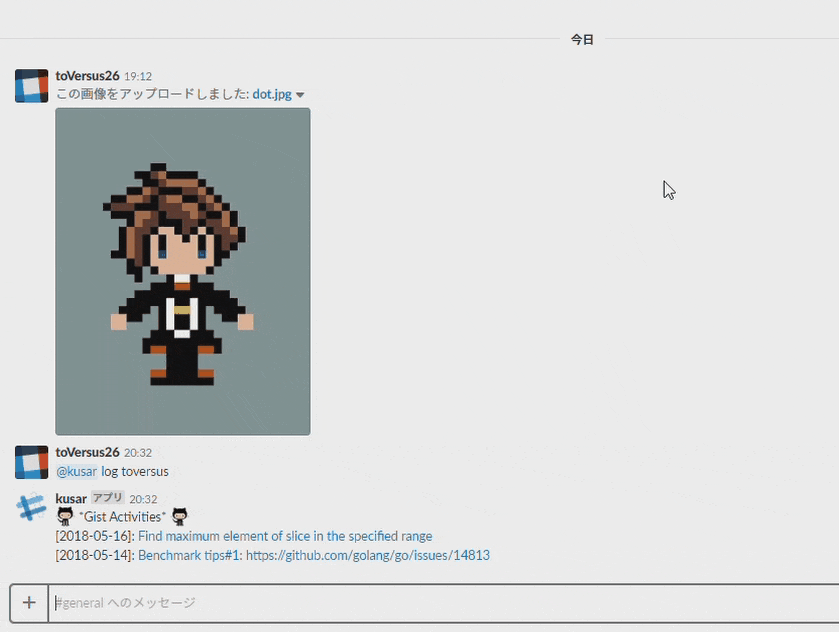

# Slack Kusar
Slack Kusar is Slack bot to list the Gist activities. The concept of this bot was inspired by [go-slack-interactive @tcnksm](https://github.com/tcnksm/go-slack-interactive).



## Usage
To run this bot, set the following environment variables:

```
export BOT_ID="U***"             // you can get this after create a bot user (via slack app management console)
export BOT_TOKEN="xoxb-***"      // you can get this after create a bot user (via slack app management console)
export VERIFICATION_TOKEN="***"  // you can get this after enable interactive message (via slack app management console)
export CHANNEL_ID="C***"         // bot reacts only this channel
```

### For Heroku user...
If you want to deploy this application to Heroku, refer to the follwing instructions:

1. Login to Heroku:

```
$ heroku login
```

2. Clone this project:

```
$ git clone 
$ cd slack-kusar
```

3. Create new app on Heroku:

```
$ heroku create
```

4. Deploy this project:

```
$ go get github.com/toversus/slack-kusar
$ git push heroku master
```

5. Create new app on Slack: https://api.slack.com/apps

6. Configure request URL on Intaractive Components: https://api.slack.com/interactive-messages

> e.g. https://<Heroku Domain>/interaction

7. Invite app user to the channel: https://get.slack.help/hc/en-us/articles/201980108-Invite-members-to-a-channel

8. Set environment variables:

```
$ heroku config:set BOT_ID=U***
$ heroku config:set BOT_TOKEN=xoxb-***
$ heroku config:set CHANNEL_ID=C***
$ heroku config:set VERIFICATION_TOKEN=***
$ heroku config:set GIST_ACCESS_TOKEN=***
```

## Reference
https://devcenter.heroku.com/articles/getting-started-with-go#introduction
